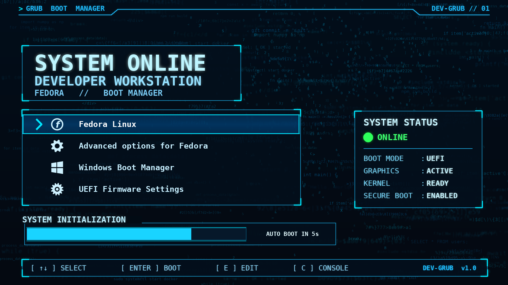

# Developer GRUB Theme

A modern and attractive **GRUB bootloader theme** designed for developers and Linux enthusiasts. It provides a clean, developer-focused boot menu with a custom background, readable typography, and a polished interface.

## Preview



## Features

- 🎨 Custom developer-themed background
- 💻 Modern and clean GRUB interface
- 🔤 Improved text readability
- 🐧 Designed for Linux systems
- 🖥️ 1920×1080 resolution support
- ⚙️ Easy installation with `install.sh`
- 🛠️ Customizable `theme.txt`
- 🚀 Lightweight and simple

## Project Structure

```text
developer-grub-theme/
├── background.png
├── theme.txt
├── install.sh
├── fonts/
├── preview.png
└── README.md
```

## Installation

### 1. Clone the repository

```bash
git clone https://github.com/kishan0726/grub-theme.git
```

### 2. Enter the project directory

```bash
cd grub-theme
```

### 3. Make the installation script executable

```bash
chmod +x install.sh
```

### 4. Install the theme

```bash
sudo ./install.sh
```

### 5. Reboot

```bash
sudo reboot
```

After rebooting, the Developer GRUB Theme should appear in your GRUB boot menu.

## Customization

The appearance of the theme can be customized by editing:

```text
theme.txt
```

You can change:

- Font size
- Font family
- Menu position
- Text appearance
- Selection style
- Background image
- Boot menu layout

To use your own background, replace:

```text
background.png
```

with your desired image.

## Recommended Resolution

The theme is designed primarily for:

```text
1920 × 1080
```

The theme may also work on other resolutions, but some layout adjustments in `theme.txt` may be required.

## Tested On

- Fedora Linux
- GRUB2
- 1920×1080 display

## Important

Before modifying GRUB, make sure you have access to your system's recovery options.

It is recommended to keep a backup of your original GRUB configuration before installing a custom theme.

## Contributing

Contributions and improvements are welcome!

1. Fork this repository.
2. Create a new branch.
3. Make your changes.
4. Commit your changes.
5. Open a Pull Request.

## Support

If you like this project, consider giving the repository a ⭐ on GitHub.

---

**Made with ❤️ for Linux developers and enthusiasts.**
